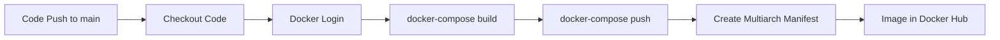

# GitHub Actions CI/CD Pipeline for eShopOnContainers

This directory contains the CI/CD workflows for automating the build, test, and deployment of eShopOnContainers microservices.

## 📁 Structure

```
.github/workflows/
├── composite/
│   └── build-push/
│       └── action.yml              # Reusable composite action for Docker build & push
├── catalog-api.yml                 # Catalog API CI/CD pipeline
├── basket-api.yml                  # Basket API CI/CD pipeline
├── identity-api.yml                # Identity API CI/CD pipeline
├── ordering-api.yml                # Ordering API CI/CD pipeline
├── ordering-backgroundtasks.yml    # Ordering Background Tasks CI/CD pipeline
├── ordering-signalrhub.yml         # Ordering SignalR Hub CI/CD pipeline
├── payment-api.yml                 # Payment API CI/CD pipeline
├── webhooks-api.yml                # Webhooks API CI/CD pipeline
├── webmvc.yml                      # Web MVC CI/CD pipeline
├── webspa.yml                      # Web SPA CI/CD pipeline
├── webstatus.yml                   # Web Status CI/CD pipeline
├── mobileshoppingagg.yml           # Mobile Shopping Aggregator CI/CD pipeline
└── webshoppingagg.yml              # Web Shopping Aggregator CI/CD pipeline
```

## 🔧 Setup Instructions

### 1. Configure GitHub Secrets

Go to your repository → **Settings** → **Secrets and variables** → **Actions**, and add:

#### Required Secrets:
- `REGISTRY_HOST` - Your container registry host (e.g., `docker.io` for Docker Hub)
- `REGISTRY_ENDPOINT` - Your registry username/repository (e.g., `jem9707`)
- `USERNAME` - Your Docker Hub username
- `PASSWORD` - Your Docker Hub access token (create from Docker Hub → Account Settings → Security)

### 2. Configure Environments (Optional for manual approval)

Go to **Settings** → **Environments** and create:
- `development` - Auto-deploy on develop branch
- `test` - Auto-deploy on main branch
- `production` - Requires manual approval before deployment

## 🚀 Workflows

All microservices follow the same CI/CD pattern:

### Available Workflows:

**Backend APIs:**
- `catalog-api` - Product catalog microservice
- `basket-api` - Shopping basket microservice
- `identity-api` - Authentication & authorization service
- `ordering-api` - Order management microservice
- `ordering-backgroundtasks` - Ordering background jobs
- `ordering-signalrhub` - Real-time order notifications
- `payment-api` - Payment processing service
- `webhooks-api` - Webhook management service

**Frontend Applications:**
- `webmvc` - ASP.NET MVC web application
- `webspa` - Single Page Application (Angular)
- `webstatus` - Health check dashboard

**API Gateways:**
- `mobileshoppingagg` - Mobile backend for frontend
- `webshoppingagg` - Web backend for frontend

### Workflow Pattern

Each workflow follows this structure:

### Workflow Pattern

Each workflow follows this structure:

**Triggers:**
- Push to `main` branch (when service code or BuildingBlocks change)
- Pull requests to `main` (validation only, no build/push)
- Manual workflow dispatch

**Jobs:**
1. **BuildLinux** - Build Docker image using docker-compose and push to Docker Hub
   - Enables Docker experimental features
   - Logs in to container registry
   - Builds using docker-compose
   - Pushes to Docker Hub
   - Creates multiarch manifest

### Basket API Pipeline (`basket-api.yml`)

Same structure as Catalog API but for Basket microservice.

## 📊 Pipeline Flow



## 🔑 Key Features

### ✅ Automated Build & Push
- Uses docker-compose for consistent builds
- Automatic push to Docker Hub on main branch
- Branch-based tagging strategy

### 🐳 Docker Image Management
- Multi-stage builds for optimized images
- Docker experimental features enabled
- Multiarch manifest support
- Automatic push to Docker Hub

### 🔄 Composite Actions
Reusable `build-push` action eliminates code duplication across workflows:
- Standardized Docker build process
- Consistent tagging with branch names
- Built-in registry login

## 🎮 Manual Deployment

Trigger manual builds via GitHub Actions UI:

1. Go to **Actions** tab
2. Select a workflow (e.g., Catalog API, Basket API, etc.)
3. Click **Run workflow**
4. Select branch (main recommended)
5. Click **Run workflow** button

## 📝 Workflow Customization

### Adding New Microservices

1. Copy `catalog-api.yml` or `basket-api.yml`
2. Update these variables:
   ```yaml
   env:
     SERVICE_NAME: your-service-name
     DOCKERFILE_PATH: path/to/Dockerfile
     CONTEXT_PATH: path/to/context
     HELM_CHART_PATH: your-chart-path
   ```
3. Update path filters in the `on` section

### Modifying Deployment Strategy

Edit the `deploy-*` jobs to:
- Add health checks
- Configure rollback strategies
- Add smoke tests
- Integrate with monitoring tools

## 🐛 Troubleshooting

### Build Failures
Check:
- .NET SDK version compatibility
- NuGet package restore issues
- Missing dependencies

### Security Scan Failures
- Review Trivy results in Security tab
- Update vulnerable dependencies
- Consider suppressing false positives

### Docker Push Failures
Verify:
- `DOCKER_HUB_USERNAME` and `DOCKER_HUB_TOKEN` secrets
- Docker Hub repository permissions
- Image size limits

### Deployment Failures
Check:
- Helm chart syntax with `helm lint`
- Kubernetes cluster connectivity
- Namespace and resource availability

## 📚 Additional Resources

- [GitHub Actions Documentation](https://docs.github.com/en/actions)
- [Docker Build Push Action](https://github.com/docker/build-push-action)
- [Helm Documentation](https://helm.sh/docs/)
- [Trivy Security Scanner](https://aquasecurity.github.io/trivy/)

## 🔐 Security Best Practices

1. ✅ Never commit secrets to repository
2. ✅ Use GitHub Secrets for sensitive data
3. ✅ Enable branch protection rules
4. ✅ Require PR reviews before merging
5. ✅ Scan for vulnerabilities in every build
6. ✅ Use minimal base images (alpine)
7. ✅ Implement least privilege access
